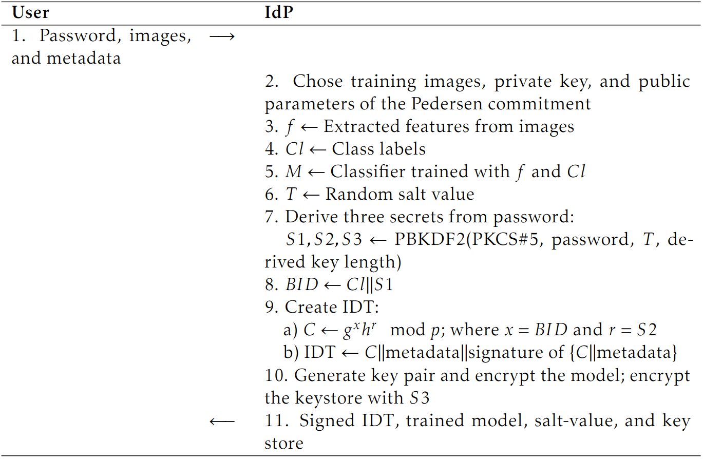
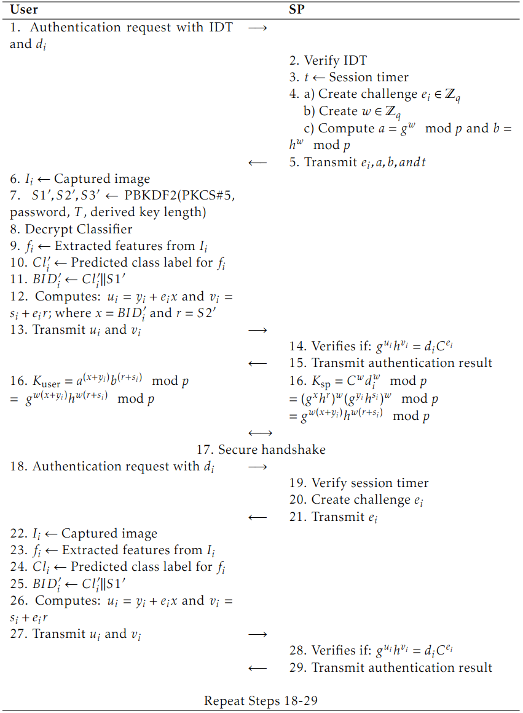

First, the user must send their biometric images, a password, and additional metadata to the IdP, as shown in Figure 1 below. Next, the IdP selects random images from its database according to the scheme described in "Training Data" and extracts features from these images as well as the user’s submitted image. A randomly generated 128-bit class label is assigned to the extracted features for each person and used to train the multi-class SVM, as further detailed in "SVM"". 

After the training process, the enrolment user’s images are deleted from the IdP, as they are no longer required. Next, a random 128-bit salt value is generated. This salt is combined with the user’s password to derive three passwords (S1, S2, S3) using the **Password-Based Key Derivation Function 2 (PBKDF2)**. The PBKDF2 enables the deterministic and cryptographically secure derivation of multiple passwords from a single input. This allows the user to enter only one password while generating three distinct passwords for different application purposes.

The **BID** is then created using the output of the multi-class SVM, specifically the class label of the legitimate user, combined with S1, as detailed in "BID". A Pedersen commitment \( C = g^x h^r \mod p \) is subsequently constructed, where \( x = \text{BID} \) and \( r = S2 \). This commitment is supplemented with metadata and a signature over the commitment and the metadata to form the **IDT**. The metadata includes at minimum the Social Security number and the public parameters of the Pedersen commitment, which is further discussed in "Metadata".

Finally, Gunasinghe and Bertino generate an asymmetric key pair to encrypt the classifier, without providing a justification for preferring an asymmetric approach over a symmetric one. Since the key pair is solely used for encryption, we opted for a symmetric key and employed AES, as it offers greater efficiency and faster encryption. This key is then encrypted with S3 and sent to the user along with the encrypted classifier, the IDT, and the salt value.

In summary:
- **S1** is utilised for the BID  
- **S2** for the commitment  
- **S3** for encrypting the key pair  

---

### Training Data

With each new enrolment, the server automatically selects the training data from a predefined set of individuals. The optimal training set size has been determined according to the objectives and methodology outlined in the paper. Based on the evaluation results, the training dataset comprises images from **30 randomly selected individuals** out of the **62 available**, along with at least **ten images** that the enrolling user must upload. The number of images per training individual varies depending on availability but includes a minimum of **20 images per person**.

---

### Feature Extraction

For feature extraction, we utilised **Inception-ResNet v1** from the `facenet_pytorch` library, pre-trained on the **VGGFace2** database. If a compatible graphics card is available, it is used to accelerate the process. The classification function of the model is deactivated, as classification is performed by the SVM. 

Since the images are already aligned, they are resized to **160x160 pixels**, as recommended by the authors. The images are then normalised, and a batch dimension is added to format them correctly for the model.

> Note: Determining the optimal batch size is outside the scope of this work; a batch size of one is used.

The model outputs **512-dimensional embeddings** of the images, which are stored as **NumPy arrays**.

---

### BID

After selecting the training users, a **128-bit random number** is generated for each user, including the enrolment user. This number serves as a class label and is used, along with the extracted features, to train the **multi-class SVM**.

The class label is then concatenated with **S1** to form the **BID**, defined as: BID = Cl∥S1

This design ensures **revocability**, **uniqueness**, and **repeatability**. The password-derived secret (S1) enhances security by ensuring that even if the same user retrains, a different BID is created.

---

### SVM

For the SVM implementation, we used the `sklearn` package from the **scikit-learn** library, specifically the **SVC** module. When invoking the method, kernel type and hyperparameters can be specified.

The chosen configuration:

- Kernel: **RBF**
- Gamma: **0.03125**
- C: **8**

Results:

- **99.37% accuracy** on the test dataset
- **97.82% accuracy** on the validation dataset

---

### Metadata

Since there is no direct communication between the **SP** and the **IdP**, the SP queries its continuous authentication server to check for an **active session**. The metadata must uniquely identify the user. Gunasinghe and Bertino propose including:

- **Name**
- **Email**
- **Social Security number**

Despite its sensitivity, the Social Security number is adopted since it is only stored within the **IDT** and accessed only by **trusted SPs**.

The metadata also includes public parameters of the **Pedersen commitment**, required for computing commitments during the authentication protocol:

- **p** and **q**: large prime numbers
- **g** and **h**: generators of the cyclic group

A **timestamp** from the IdP is also included, defining the **validity period** of the IDT. Once expired, the enrolment process must be repeated.

